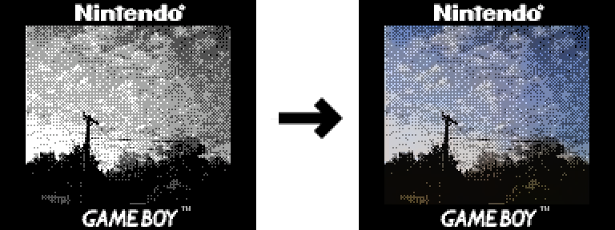

# GB Colorize

Colorize your GameBoy Camera photos! Live demo [here](https://gaunsessa.github.io/gbcolorize/).

<p align="center">
    
</p>

## Training own model

### Create dataset

To create your own dataset, you can use the `dataset.py` script. This script will split the images into train and val sets, and process them into the format required by the model.

```bash
python dataset.py --input <input_dir> --output <output_dir> --split_size <split_size> --shard_size <shard_size> --chunk_size <chunk_size> --workers <workers> --device <device>
```

### Train model

To train your own model, you can use the `train.py` script. This script will train the model on your dataset.

```bash
python train.py --model <model> --size <size> --dataset <dataset> --batch <batch> --lr <lr> --epochs <epochs> --weight_alpha <weight_alpha> --workers <workers> [--binned]
```

### Export model

To export your model, you can use the `onnx_export.py` script. This script will export the model to an ONNX file.

```bash
python onnx_export.py --model <model> --ckpt_path <ckpt_path> --onnx_dest <onnx_dest>
```

The exported ONNX file can be used in the web demo by moving it to the `web/` directory.